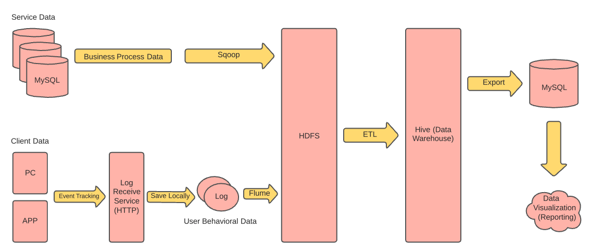
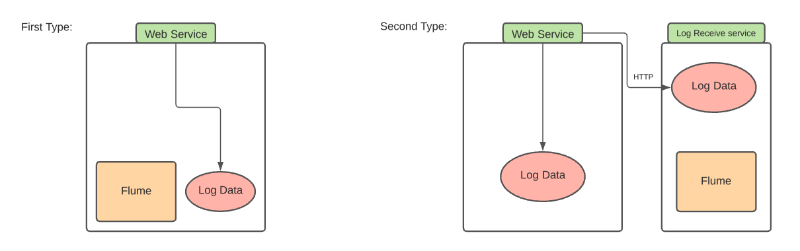
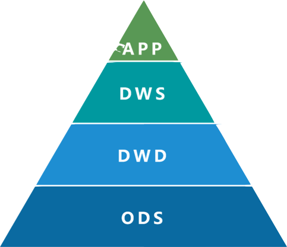

<h1 align="center"> e-commerce analytics data warehouse solution</h1>

## Introduction
For a e-commmerce site, data can be generate from both the client side and services side. When a user is browsing the site, we can have even trackers in place to capture user's information immediately when they loggin in like their device time, their internet connection type, webpage loading time, what platform did they use(mobile vs desktop), what products the user has browsed, for how long, etc. These information is useful for us to conduct meaningful analysis, so we can optimize our site and send product recommendations, ads to user to potentially generate more revenue. On the service side, we have order, payment, shipment information usually stored in a relational database. 

This project simulates a real e-commerce site data situation. The goal is to first use proper tool and set proper pipeline to first collect data from log server and mySQL database and save them to HDFS. Then we build a multi-layer datawarehouse in Hive using raw data from HDFS. Finally, we export aggregate metrics to MySQL for dashboar visualization. 

## Architecture Diagram

**Flume Setup Choice**

We could set up our flume agent on the same machine our service API machine, but this might impact our web service performance. The better choice is to set up a dedicated log service to receive logs and have our flume agent set up there. 

## Data Warehouse

- **ODS**: Operational Data Store. We just build hive external table for the original dataset here. 
- **DWD**: Data Warehouse Detail. Clean ODS layer tables and take care of data quality and completeness issues here. 
- **DWS**: Datawarehouse Service Layer. In this layer we slightly aggregate to create intermediate tables optimized for resuability to serve different business needs. 
- **APP**: Application Data Store. Based on business needs, we create aggregated metrics for later dashboard or analytics consumption. 

## Metrics
### User Data
- **Daily User Metrics**:
	- Daily User Count
	- Year to Year & Current Reprdong Period vs Previous Reporting Period new user count comparion
- **Daily Active User Metrics**:
	- Daily activy users.
	- Daily active users (day of day, same day week over week).
- **7 days users attrition (users not active for 7 days)**
	- send Push notification for these users.
- **Daily Usage Metrics**:
	- Daily Average App Opening Counts by person
	- Daily App Opening Counts Distribution (1, 2, 3 or more)
- **Active Users OS related Metrics**:
	- OS distribution (iOS/Android/etc)
	- Android Version Distribution
	- iOS version distri.
	- Device brand distri.
	- Device Model distri.
	- Internet Connection Type distri (WiFi/4G/5G/etc.)
- **App Crash Related Metrics**:
	- Daily Total Crash Counts (Android, iOS)
	- Daily Android Crash Counts for different Versions
	- Daily iOS Crash Counts for different Versions

### Order Data
- **User Information (normalized to allow easy lookup)**
- **e-Commerce GMV (Sales over specified period)**
	- GMV: Total sales amount over specified period of time, common metric in e-Commerce.
- **Product Related Metrics**:
	- Product Sales (Product name, Category, Orders Total, Sales Total)
	- Top 10 Product by Sales
-**Conversion Rate Metrics**:
	- Conversion Rate Metrics

### Code
- **/log**: user_action.log. This is the sample client log file
- **useraction-to-hdfs.conf**: config file for setting up Flume agent to copy log file on change to HDFS 
- **sqoop_collect_data_util.sh**: shell script for Sqoopy to run user defined query to copy data to HDFS. 
- **/warehouse_shell_good_order**:shell scripts for daily automated HIVE table refresh. 

## Automation
### Shell Script
- Write shell scripts to automate data daily refresh and incrementation. 

### Workflow Manager
- Recommend use distributed Workflor Manager [Azkaban](https://azkaban.github.io). Its built by Linkedin for solving Hadoop job depednencies. 
